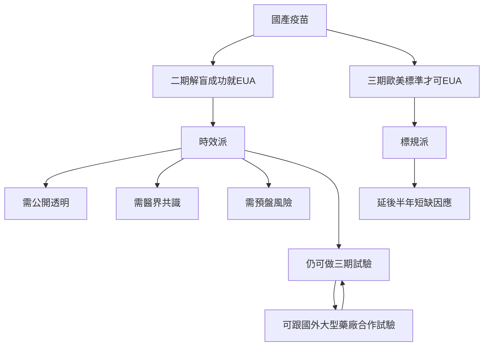

使用 Markdown 書寫的時候，你可以直接將想法輸入到編輯器中：

* 先不對文字進行視覺上的調整 （例如：變成粗體、標題、分項目），專注把想法表達出來。
* 當內容比較完整的時候，再來使用語法排版。
* 也可以充分運用 HackMD 的雙欄模式，你在編輯器寫作，同時檢視「被呈現」的模樣：
  先寫出結構，大標題、次標題、文件資訊的醒目提示
  有個排版的基本想法，再來填充文字內容。
  

# 第一標題
## 第二標題
### 第三標題
#### 第四標題
##### 第五標題
###### 第六標題 (最小到六)

- 無序清單 Level 1
  - 無序清單 Level 2
    - 無序清單 Level 3
- 無序清單 Level 1

1. 有序清單 Level 1
2. 有序清單 Level 1
   1. 有序清單 Level 2
      1. 有序清單 Level 3

*斜體*

**粗體**

插入圖片(滑鼠移到圖片上：無文字 vs 有文字)

 

插入Youtube影片



